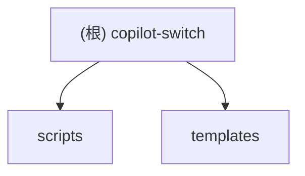

# copilot-switch

## 项目愿景
提供一组 macOS LaunchAgent 安装/卸载脚本与 plist 模板，用于启动、切换或卸载本地 copilot-api 服务，并配套生成配置与日志位置，方便在桌面环境中常驻运行。

## 架构总览
- Shell 安装/卸载脚本：`scripts/install_copilot_agent.sh`、`scripts/uninstall_copilot_agent.sh` 负责渲染 LaunchAgent plist、创建配置、链接 CLI、重载 launchd。
- LaunchAgent 模板：`templates/com.zephyrus.copilot-api.plist.tmpl`，通过 `sed` 替换占位符生成 plist，入口命令基于 `bun run start`。
- 运行期产物：`~/Library/LaunchAgents/<label>.plist`、日志 `~/Library/Logs/<label>.out/err.log`、配置 `config/copilot-switch.conf`（运行时生成）。
- CLI 可执行：`bin/copilotctl`（二进制，安装时链接到 `~/bin/copilotctl`）。
- 依赖：macOS `launchctl`、`plutil`、`sed`、`bash`、`bun`。

## 模块结构图

## 模块索引
| 模块 | 路径 | 职责 | 文档 |
| --- | --- | --- | --- |
| scripts | `scripts` | 安装/卸载 copilot-api 的 LaunchAgent，生成配置与 CLI 链接 | [scripts/CLAUDE.md](./scripts/CLAUDE.md) |
| templates | `templates` | LaunchAgent plist 模板（启动命令、环境变量、日志配置） | [templates/CLAUDE.md](./templates/CLAUDE.md) |

## 运行与开发
- 前置依赖：macOS、`launchctl`、`plutil`、`sed`、`bash`，以及运行 copilot-api 所需的 `bun`。
- 安装启动：
  - `./scripts/install_copilot_agent.sh --dir "<copilot-api 路径>" [--account individual|business|enterprise] [--label <名称>] [--log-dir <目录>]`
  - 产物：`~/Library/LaunchAgents/<label>.plist`（启用 KeepAlive/RunAtLoad）、日志文件、`config/copilot-switch.conf`、`~/bin/copilotctl` 链接。
- 卸载：
  - `./scripts/uninstall_copilot_agent.sh [--label <名称>] [--plist <path>] [--config <path>] [--log-dir <path>] [--remove-logs] [--remove-config] [--remove-cli] [--force]`
  - 默认行为：`launchctl bootout` + 删除 plist，可选清理日志/配置/CLI。
- PATH 提示：如需直接调用 `copilotctl`，确保 `~/bin` 在 PATH 中。

## 测试策略
- 暂无自动化测试；手动验证：
  - `plutil -lint ~/Library/LaunchAgents/<label>.plist` 校验 plist。
  - `launchctl print gui/$(id -u)/<label>` 查看服务状态。
  - 检查日志：`~/Library/Logs/<label>.out.log` 与 `~/Library/Logs/<label>.err.log`。

## 编码规范
- Shell：`set -euo pipefail`、使用 `[[ ]]`、函数化参数解析与校验；模板渲染使用 `sed`，渲染后用 `plutil` 校验。
- 路径：统一规范化至绝对路径；生成文件放置在用户级目录（`~/Library/LaunchAgents`、`~/Library/Logs`、`~/bin`）。

## AI 使用指引
- 优先关注 `scripts/` 与 `templates/`；`bin/copilotctl` 为二进制，不要修改。
- 配置与日志路径依赖用户环境，勿伪造路径或提交用户本地数据。
- 需要扩展时，请保持与现有参数/文件约定兼容。

## 变更记录
- 2025-12-11T12:27:24+0800 初始化 CLAUDE 文档与模块索引。
